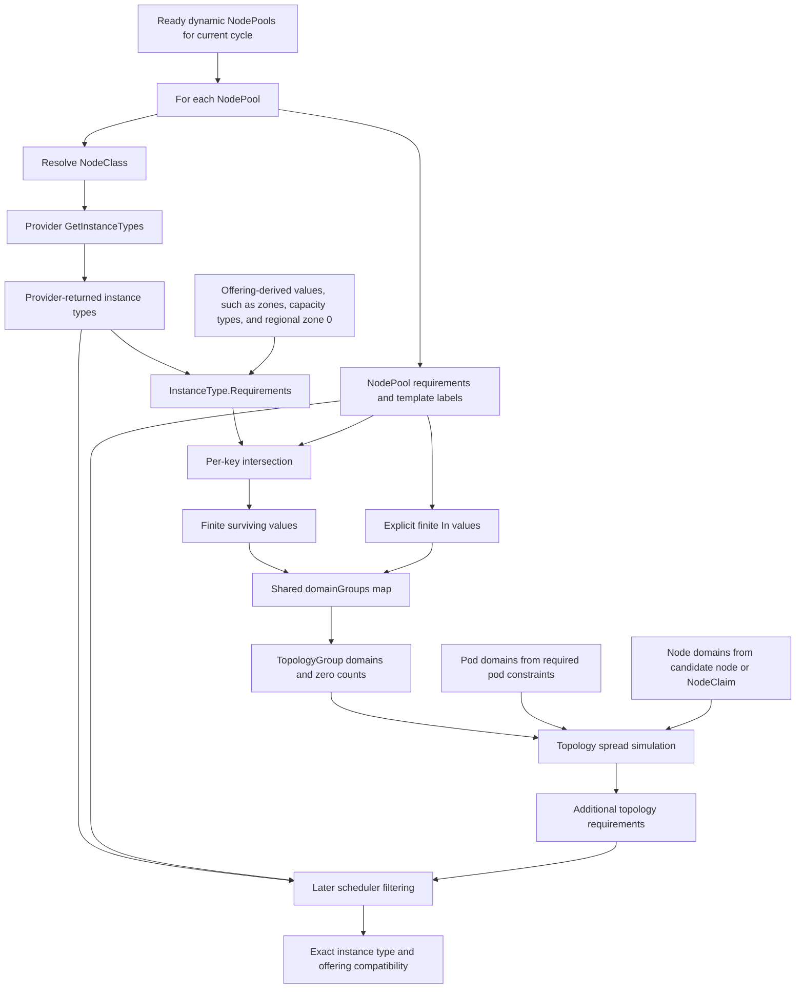

# Topology Domain Value Construction

This document summarizes how Karpenter composes the universe of domain values used by topology spread and affinity logic. The relevant upstream scheduling function is `buildDomainGroups`, which creates a shared `domainGroups` map for the current provisioning cycle.

This document assumes regional Azure VM offerings are represented with the AKS regional zone value `"0"`. Older empty-string behavior is described separately in [Historical Empty-String Behavior](#historical-empty-string-behavior).

## Table of Contents

- [Overview](#overview)
  - [TL;DR](#tldr)
  - [Short Summary](#short-summary)
  - [Key Terms](#key-terms)
- [Mechanics](#mechanics)
  - [Detailed Flow](#detailed-flow)
  - [Flowchart](#flowchart)
  - [NodeClass-Scoped Instance Types](#nodeclass-scoped-instance-types)
  - [Where Actual Nodes Come In](#where-actual-nodes-come-in)
- [Examples](#examples)
  - [Zone Example](#zone-example)
  - [Cross-NodePool Pollution Example](#cross-nodepool-pollution-example)
  - [Regional Zone Example](#regional-zone-example)
- [Working With It](#working-with-it)
  - [Recommendations for Reliable Zone Spread](#recommendations-for-reliable-zone-spread)
  - [Common Failure Modes](#common-failure-modes)
  - [Workload-Level Zone Filtering](#workload-level-zone-filtering)
  - [NodePool Targeting Versus Zone Targeting](#nodepool-targeting-versus-zone-targeting)
- [Design Considerations](#design-considerations)
  - [NodeClass Fields Versus NodePool Requirements](#nodeclass-fields-versus-nodepool-requirements)
- [Caveats and History](#caveats-and-history)
  - [Offering Precision Caveat](#offering-precision-caveat)
  - [Compatibility Caveat](#compatibility-caveat)
  - [Historical Empty-String Behavior](#historical-empty-string-behavior)
- [Related Issues and PRs](#related-issues-and-prs)

## Overview

### TL;DR

When a pod doesn't _narrow_ the topology domains it participates in, Karpenter _spreads_ it across every value _derived_ for that key in the current provisioning _cycle_ — pooled from all NodePools, not just the one the pod will land on. So two things follow:

1. A NodePool the pod can't even use can still add domain values that affect the pod's spread math.

2. If any NodePool leaves the topology key unconstrained, values _derived_ for that key from its instance types can enter the universe. On Azure zones, that can include zonal values plus the regional value `"0"`.

Selecting a NodePool by some other label (like a custom `pool=primary`) doesn't fix this by itself. To control the spread universe, either _narrow_ the domains on the workload itself, or constrain the topology key on every considered NodePool.

This describes the current shared-domain behavior. Upstream has already attempted to make topology domains more NodePool-aware, so this area may change if a replacement for that work relands; see [Related Issues and PRs](#related-issues-and-prs).

Notes:

* _narrow_: On the workload side, topology domains can be narrowed in two different ways. A required pod-level constraint on the topology key, typically `requiredDuringSchedulingIgnoredDuringExecution` node affinity with an `In` match on the key or a `nodeSelector` on it, narrows the pod's supported domain set. Separately, `nodeTaintsPolicy: Honor` can filter out domains contributed only by NodePools whose taints the pod does not tolerate. `preferredDuringSchedulingIgnoredDuringExecution` and the topology spread constraint's `topologyKey` alone do not narrow the pod's supported domain set. See [Workload-Level Zone Filtering](#workload-level-zone-filtering) for an example.

* _spreads_: Here, "spreads" means Karpenter evaluates topology-spread skew against those values during provisioning simulation. It does not mean every value is guaranteed to be a valid final placement target; candidate node domains, NodePool compatibility, offerings, resources, and kube-scheduler still apply.

* _derived_: The values come from each NodePool's requirements/template labels and from the requirements of the instance types the provider returns for that NodePool's NodeClass — which include offering-derived values like zones. That instance type list is the broad provider-returned set for the NodeClass, not pre-filtered by the NodePool's other constraints. "Derived" here does not require an actual Node: a zone (or the regional `"0"`) can land in the universe purely because some instance type advertises it, even if no Node currently exists there. Values from real Nodes can also be picked up at the topology-group level later in scheduling — see [Where Actual Nodes Come In](#where-actual-nodes-come-in).

* _cycle_: "Current provisioning cycle" means the ready, dynamic, non-deleting NodePools that resolved to instance types this round (under normal circumstances, this is effectively all active NodePools in the cluster). This is about Karpenter's provisioning simulation, not kube-scheduler's final binding. Exact instance type, resource, and offering compatibility is rechecked later during scheduling.

### Short Summary

Domain values are built as a shared universe across the NodePools considered in the current scheduling cycle. For each NodePool, Karpenter pulls the provider-returned instance types for its NodeClass and reads each instance type's requirements (including offering-derived values such as zones). Those requirements are intersected per key with the NodePool requirements and template labels, and for finite value sets such as zones, the surviving values go into one shared domain map. Karpenter also inserts explicit finite `In` values from the NodePool requirements and template labels directly.

The resulting `domainGroups` map is intentionally coarse. It can include values from multiple NodePools and from provider-returned instance types that are not ultimately usable by a given workload. Exact pod, NodePool, instance type, resource, and offering compatibility is checked later during scheduling simulation and before launch.

For topology spread constraints, this means the domain universe used for skew math can be broader than the NodePool that eventually provisions a pod. If a workload does not explicitly constrain the topology key, extra domain values such as the Azure regional value `"0"` can participate in that workload's spread calculation.

### Key Terms

- Domain key: the label key used for a topology dimension, such as `topology.kubernetes.io/zone`, `kubernetes.io/hostname`, or another label used by affinity/topology logic.
- Domain value: a concrete value for a domain key, such as `eastus2-1` for `topology.kubernetes.io/zone`.
- Regional zone value: Azure's non-zonal AKS node zone label value, `"0"`.
- Domain group: the set of known domain values for one domain key, plus the NodePool taints associated with each value.
- Considered NodePools: the schedulable NodePools selected for the current provisioning cycle, not necessarily every NodePool object in the cluster.
- Provider-returned instance types: the instance type list returned by `GetInstanceTypes(ctx, nodePool)`. In Azure and AWS this is generally scoped by the NodePool's NodeClass/provider context, but is broader than the final NodePool-compatible instance type set.
- Pod domains: the set of topology values a pod is considered to support for a topology key. If the pod has no required constraint on that key, Karpenter treats this as `Exists`.
- Node domains: the set of topology values a candidate existing node or simulated NodeClaim can provide for a topology key.

## Mechanics

### Detailed Flow

1. The provisioner selects NodePools that are eligible for the current scheduling cycle.

2. For each eligible NodePool, the provisioner calls `GetInstanceTypes(ctx, nodePool)` and stores the result in a map keyed by NodePool name.

3. `NewTopology` calls `buildDomainGroups` before the scheduler performs its stronger NodePool-compatible instance type filtering.

4. `buildDomainGroups` loops over each NodePool and each provider-returned instance type for that NodePool.

5. For each NodePool + instance type pair, it combines:
   - NodePool template requirements
   - NodePool template labels, converted into requirements
   - Instance type requirements

6. Requirements for the same key are intersected independently, key by key. This prevents an instance type from expanding a finite NodePool constraint for that key.

7. For finite `In`-style requirements, including Azure zone offering requirements, every allowed value that survives those per-key intersections is inserted into the shared `domainGroups` map under its requirement key. Complement-style requirements still have stored values, but those values are exclusions rather than surviving allowed domains; the examples below focus on finite topology domains like zones.

8. Each inserted value is associated with the NodePool's taints. Later topology logic can use those taints when it needs to honor pod tolerations.

9. After processing instance types for a NodePool, the function also inserts explicit finite `In` values from the NodePool requirements and template labels directly into `domainGroups`.

10. Later, topology spread and affinity use `domainGroups` as the known universe of possible domains.

11. During scheduling simulation, `Topology.AddRequirements` asks each matching topology group to tighten the candidate node requirements.

12. For topology spread, `nextDomainTopologySpread` computes the current minimum count across the pod-supported domains, then chooses a candidate node domain that keeps skew within `maxSkew`.

13. Separately, scheduler filtering checks exact instance type compatibility, resource fit, and compatible concrete offerings before launch.

### Flowchart



### NodeClass-Scoped Instance Types

The instance type list is not a single cluster-global list handed unchanged to every NodePool. For each considered NodePool, Karpenter resolves the NodePool's `nodeClassRef` and calls the cloud provider's `GetInstanceTypes(ctx, nodePool)`. In the Azure provider, that resolves the `AKSNodeClass` and calls `instanceTypeProvider.List(ctx, nodeClass)`.

That means the provider-returned instance type list is scoped by the NodeClass before `buildDomainGroups` sees it. Azure uses NodeClass fields to shape the returned catalog and the returned instance type requirements. Examples include image family / OS SKU, OS disk size, max pods, encryption at host, LocalDNS, FIPS mode, and artifact streaming. Some settings filter unsupported SKUs out of the list; others change the requirements or capacity attached to each returned instance type.

The impact is subtle but important:

- If multiple NodePools use the same broad NodeClass, they usually receive the same broad provider-returned instance type list. Their different NodePool requirements are applied later by `buildDomainGroups` through per-key intersections and by scheduler filtering.

- If NodePools use different NodeClasses, they may receive different provider-returned instance type lists. A NodeClass that filters out a SKU also prevents that SKU's offering-derived values, such as zones or capacity types, from being contributed by that NodePool.

- NodeClass filtering is still not the same as final NodePool or workload compatibility. A NodeClass can narrow the catalog, but `buildDomainGroups` can still include values from the returned list that are later rejected by NodePool requirements, pod requirements, resources, or exact offering compatibility.

Mechanically, the path is `CloudProvider.GetInstanceTypes` -> `resolveNodeClassFromNodePool` -> `instanceTypeProvider.List(ctx, nodeClass)` -> `NewInstanceType` / `computeRequirements`. `buildDomainGroups` consumes the resulting per-NodePool instance type list.

### Where Actual Nodes Come In

Actual Nodes are not used by `buildDomainGroups`. That function only uses considered NodePools and provider-returned instance types.

Actual Node label values enter later, when Karpenter creates a `TopologyGroup` for a pod's topology spread or affinity rule and initializes that group with `countDomains`:

1. The topology group starts with the values from `domainGroups`, each with count `0`.

2. Karpenter scans known state nodes that already have a real Node object. If a Node matches the topology group's node filter and has the topology key label, Karpenter registers that label value in the group's `domains` map with count `0`. This lets an existing but currently empty zone, hostname, or other domain participate in topology math even when no selected pod is there yet.

3. Karpenter lists existing pods that match the topology selector in the relevant namespaces. For each scheduled, non-terminal, non-excluded pod, it looks up the bound Node, reads that Node's value for the topology key, applies the topology group's node filter, and increments the count for that domain.

4. When Karpenter considers placing a pending pod onto an existing node, that node's labels are converted into node requirements. Those requirements become `nodeDomains` in `Topology.AddRequirements`, so topology spread can allow or reject that specific node based on its actual topology value.

5. If Karpenter simulates adding the pod to an existing node or a new NodeClaim, `Topology.Record` increments the selected domain so later pods in the same scheduling cycle see the updated count.

So actual Nodes affect topology in two ways: they add group-local known domains and counts from the cluster's current state, and they constrain placement when a specific existing node is considered. They do not change the shared `domainGroups` map built before scheduling.

## Examples

### Zone Example

This example walks through the per-key intersection in the *well-behaved* case, where every NodePool constrains the zone key. It illustrates the guarantee that an instance type cannot *broaden* a NodePool's finite zone constraint. For the cases where extra domains *do* leak into the shared universe, see [Cross-NodePool Pollution Example](#cross-nodepool-pollution-example) and [Regional Zone Example](#regional-zone-example).

Zone names below are abstract (`zone-a`, `zone-b`, ...) to keep the arithmetic readable; real Azure zone labels look like `eastus2-1`.

Assume one scheduling cycle has two considered NodePools, `pool-a` and `pool-b`, and both reference the same NodeClass. Because they share the same NodeClass, the provider normally returns the same broad instance type list for both pools.

NodePool constraints:

```text
pool-a: zone In [zone-a, zone-b]
pool-b: zone In [zone-c, zone-d]
```

Provider-returned instance types for both NodePools:

```text
SKU-1
SKU-2
```

Assume the provider has rolled up available offering zones into each instance type's requirements:

```text
SKU-1: zone In [zone-a, zone-c]
SKU-2: zone In [zone-b, zone-d]
```

`buildDomainGroups` evaluates each NodePool + instance type pair:

```text
pool-a + SKU-1:
  [zone-a, zone-b] intersect [zone-a, zone-c]
  => zone-a

pool-a + SKU-2:
  [zone-a, zone-b] intersect [zone-b, zone-d]
  => zone-b

pool-b + SKU-1:
  [zone-c, zone-d] intersect [zone-a, zone-c]
  => zone-c

pool-b + SKU-2:
  [zone-c, zone-d] intersect [zone-b, zone-d]
  => zone-d
```

Those surviving values are inserted into the shared domain map:

```text
topology.kubernetes.io/zone:
  zone-a
  zone-b
  zone-c
  zone-d
```

The direct `In` pass also inserts `pool-a`'s explicit zones and `pool-b`'s explicit zones, which reinforces the same four values in this example.

Note what does *not* happen: although `SKU-1` advertises `zone-c` for `pool-a`, that value is filtered out by the per-key intersection with `pool-a`'s constraint. The instance type cannot smuggle `zone-c` into `pool-a`'s contribution. The shared map ends up with `zone-c` only because `pool-b` legitimately includes it.

### Cross-NodePool Pollution Example

This example shows the *misbehaved* case: an unconstrained second NodePool leaks domain values into the shared universe and breaks topology spread math for a workload that targets the first NodePool.

Setup. Two NodePools share the same NodeClass, so the provider returns the same instance type list for both. Only `pool-a` constrains the zone key; `pool-decoy` doesn't. The workload selects `pool-a` via a non-topology label.

```text
pool-a:     zone In [zone-a, zone-b, zone-c], label pool=primary
pool-decoy: no zone requirement,              label pool=decoy

workload:
  nodeSelector pool=primary
  topologySpreadConstraint:
    topologyKey: topology.kubernetes.io/zone
    maxSkew: 1
    whenUnsatisfiable: DoNotSchedule
```

Provider-returned instance types (same list for both pools, same offering roll-up):

```text
SKU-1: zone In [zone-a, zone-b, zone-c]
```

`buildDomainGroups` evaluates each NodePool + instance type pair:

```text
pool-a + SKU-1:
  [zone-a, zone-b, zone-c] intersect [zone-a, zone-b, zone-c]
  => zone-a, zone-b, zone-c

pool-decoy + SKU-1:
  (no zone constraint) intersect [zone-a, zone-b, zone-c]
  => zone-a, zone-b, zone-c
```

So far so good. Now suppose the provider also returns a regional-capable instance type for both pools (because the NodeClass admits it):

```text
SKU-regional: zone In [0]
```

Per-key intersection:

```text
pool-a + SKU-regional:
  [zone-a, zone-b, zone-c] intersect [0]
  => (empty) -- nothing contributed

pool-decoy + SKU-regional:
  (no zone constraint) intersect [0]
  => 0
```

The shared `domainGroups` map ends up with:

```text
topology.kubernetes.io/zone:
  zone-a
  zone-b
  zone-c
  0
```

Now the topology spread simulation for the workload. The workload doesn't narrow the zone domains, so `podDomains = Exists` covers all four values. After Karpenter places one pod per real zone, the counts are:

```text
counts = zone-a: 1, zone-b: 1, zone-c: 1, 0: 0
```

The next pod needs a zone domain. Every real zone is at count `1`; the regional domain `"0"` is at count `0`. With `maxSkew: 1`, picking any real zone would produce `2 - 0 > 1`, so the only skew-compliant choice is `"0"`. But `pool-a` cannot launch a regional NodeClaim (its zone constraint excludes `"0"`), and `pool-decoy` is excluded by the workload's `nodeSelector`. Karpenter reports the placement as unsatisfiable.

The workload selected `pool-a` by label. That selector keeps `pool-decoy` from launching nodes, but it does *not* remove `pool-decoy`'s contribution to `domainGroups`. The decoy's lone offering of `"0"` is enough to wedge the entire spread calculation.

A few things would unstick this:

- Add the same `zone In [zone-a, zone-b, zone-c]` constraint to `pool-decoy`. The per-key intersection then drops `"0"` from the decoy's contribution and the shared map never gets it. Cluster-level fix.

- Add required node affinity for those zones to the workload itself. `podDomains` becomes `In [zone-a, zone-b, zone-c]` and the regional value drops out of *this workload's* skew math, even though it still exists in `domainGroups`. Workload-level fix; doesn't help other workloads.

- If `pool-decoy` is taint-isolated and the workload doesn't tolerate that taint, set `nodeTaintsPolicy: Honor` on the topology spread constraint. The decoy's contribution (including `"0"`) is then ignored for this workload's skew math. Workload-level fix; only works when isolation is expressed as taints.

### Regional Zone Example

Assume a scheduling cycle has a zonal NodePool and a broad regional-capable NodePool.

```text
pool-zonal:    zone In [eastus2-1, eastus2-2, eastus2-3]
pool-regional: no zone requirement
```

If the provider returns both zonal and regional-capable instance types for `pool-regional`, `buildDomainGroups` can produce this shared domain universe:

```text
topology.kubernetes.io/zone:
  0
  eastus2-1
  eastus2-2
  eastus2-3
```

The regional value `"0"` is a valid Azure/AKS domain value for non-zonal nodes. However, it is still an additional domain from the point of view of topology spread skew math.

If a workload has no required zone constraint, Karpenter treats the pod as supporting all zone domains:

```text
podDomains = topology.kubernetes.io/zone Exists
```

The regional value can then participate in the minimum-count calculation. For example:

```text
counts = 0: 0, eastus2-1: 1, eastus2-2: 1, eastus2-3: 1
```

With `maxSkew: 1`, placing another pod in any real zone would produce `2 - 0 > 1`. If the candidate NodeClaim cannot use the regional domain, topology spread may report the placement as unsatisfiable even though the workload was expected to use only zonal capacity.

## Working With It

### Recommendations for Reliable Zone Spread

These recommendations assume the workload already declares a `topologySpreadConstraints` entry on `topology.kubernetes.io/zone` (with `whenUnsatisfiable: DoNotSchedule` if you want a hard guarantee) and that its `labelSelector` matches the workload's own pod labels. Without that, none of the topology spread machinery applies in the first place — Karpenter does build the domain universe regardless, but no skew is enforced for the workload.

Given a topology spread constraint is in place, the recommendations below shape *which domain values* participate in that workload's skew math. Prefer them in order:

1. **Constrain every considered NodePool** on `topology.kubernetes.io/zone` to the zones you actually want. This keeps the regional value `"0"` (and any unrelated zones from other NodePools) out of the shared domain universe for the whole cluster. Cluster-level fix; benefits every workload. This is a current-behavior mitigation; if upstream relands NodePool-aware topology-domain filtering, it may become less necessary for workloads that cannot use the NodePool contributing the extra domain.

2. **If you cannot reach every NodePool** (for example, in a multi-team cluster), **constrain the workload itself** with required node affinity on `topology.kubernetes.io/zone`. This narrows the workload's supported `podDomains` so unwanted values can't participate in its skew math, even if they still exist in `domainGroups`. Per-workload fix; doesn't help other workloads. See [Workload-Level Zone Filtering](#workload-level-zone-filtering).

3. **If the polluting NodePool is taint-isolated**, set `nodeTaintsPolicy: Honor` on the workload's topology spread constraint (and do not tolerate that taint). The constraint then ignores domains contributed by NodePools whose taints the pod doesn't tolerate. Narrower than option 2 — it only helps when isolation is already expressed as taints — but it requires no per-workload zone list. By default (`nodeTaintsPolicy: Ignore`), tainted NodePools still contribute domains regardless of tolerations.

Then verify:

- The workload has a `topologySpreadConstraints` entry on `topology.kubernetes.io/zone`, and its `labelSelector` matches the workload's own pod labels — otherwise existing pods aren't counted and skew calculations look wrong for unrelated reasons.
- All considered NodePools have a `topology.kubernetes.io/zone` constraint.
- No real Nodes carry unexpected topology values (including the regional `"0"`) that match the topology group's node filter; those can register as zero-count domains in the topology group regardless of `domainGroups`. See [Where Actual Nodes Come In](#where-actual-nodes-come-in).
- If you use `nodeSelector` to target a specific NodePool by a non-topology label, remember it does *not* narrow `domainGroups` — pair it with a topology-key constraint when you also care about which zones participate. See [NodePool Targeting Versus Zone Targeting](#nodepool-targeting-versus-zone-targeting).

### Common Failure Modes

- The topology spread `labelSelector` does not match the workload pod labels. In that case, the pods are not counted as part of the spread group, so placement may look uneven even though topology domain construction is not the root cause.

- The workload selects a NodePool by a non-topology label but does not constrain the topology key. Other considered NodePools can still contribute zero-count domains, including the Azure regional value `"0"`.

- A broad or unconstrained NodePool exposes regional or non-zonal capacity. The regional value becomes an extra domain; with `maxSkew: 1`, Karpenter may place one pod or node per real zone and then block because the regional domain remains at count zero.

- `minDomains` can make missing or phantom domains more visible. If Karpenter sees fewer pod-supported domains than `minDomains`, it treats the minimum count as zero; if it sees extra zero-count domains, those domains can also hold the minimum at zero and make later placements fail skew checks.

- Taints are expected to isolate NodePools, but the topology spread constraint does not set `nodeTaintsPolicy: Honor`. In that case, tainted NodePools can still contribute domains for spread math.

- Existing Nodes can add topology-group-local domains or counts after `buildDomainGroups`. Karpenter does not copy every observed Node label into the shared `domainGroups` map, but when a real Node matches the topology group's node filter and has the topology key label, that value can be registered in the group's `domains` map with count `0`; matching scheduled pods on that Node can then increment the count. System nodes or older nodes with unexpected topology labels, including zone `"0"`, can therefore affect skew if they match the node filter.

- Instance type requirements roll up offerings. A domain may appear available at the requirement level even when the exact zone, capacity type, and instance type offering combination is rejected later.

- On older Azure provider versions, regional offerings used the empty string. This can appear as a blank domain in `counts` and can also collide with Karpenter's internal "no domain selected" sentinel.

### Workload-Level Zone Filtering

A required pod-level constraint on the topology key can remove unwanted domains from that workload's topology spread calculation. For zones, this can be done with required node affinity:

```yaml
affinity:
  nodeAffinity:
    requiredDuringSchedulingIgnoredDuringExecution:
      nodeSelectorTerms:
      - matchExpressions:
        - key: topology.kubernetes.io/zone
          operator: In
          values:
          - eastus2-1
          - eastus2-2
          - eastus2-3
```

With this requirement, Karpenter uses:

```text
podDomains = topology.kubernetes.io/zone In [eastus2-1, eastus2-2, eastus2-3]
```

Instead of:

```text
podDomains = topology.kubernetes.io/zone Exists
```

The extra regional domain `"0"` may still exist in the shared `domainGroups` map, but it no longer participates in this workload's `domainMinCount` calculation. This is a workload-level workaround, not a cluster-level fix. Other workloads without a required topology-key constraint can still see the broader domain universe.

This is the key distinction: constraining every considered NodePool on `topology.kubernetes.io/zone` can keep `"0"` out of the shared domain universe produced from instance type requirements. Constraining the workload on `topology.kubernetes.io/zone` instead removes `"0"` only from that workload's supported `podDomains`, so it does not participate in that workload's skew calculation even if `"0"` still exists in `domainGroups` or was registered from a real Node.

### NodePool Targeting Versus Zone Targeting

NodePool targeting and topology-key targeting solve different problems, and they're easy to confuse:

```text
nodeSelector repro.pool=primary:
  narrows which NodePools/nodes can host the pod
  (does NOT necessarily narrow domain values in domainGroups)

required zone affinity:
  narrows which zone domains the pod supports for topology spread
  (does NOT prevent other NodePools from launching nodes)
```

If you need both — the right NodePool *and* the right zones — apply both constraints to the workload.

## Design Considerations

### NodeClass Fields Versus NodePool Requirements

The topology-domain behavior described above is one input when deciding where to model a new provider capability — beyond API shape, it affects which instance types and offering-derived values appear in the shared topology domain universe.

A NodeClass field is part of provider launch configuration. If a capability makes some SKUs or offerings unlaunchable for that NodeClass, the provider can reflect that by dropping them from the returned instance type list. Anything dropped at this stage cannot contribute topology domains for NodePools using that NodeClass — an early, provider-scoped filter that keeps unsupported capacity out of topology math entirely.

A NodePool requirement is part of scheduling policy for a pool. It is usually the better fit for workload-owned capacity selection: VM family, architecture, accelerator shape, capacity slice, or other choices that should vary across NodePools while sharing the same launch configuration. During topology-domain construction, NodePool requirements are intersected with instance type requirements one key at a time. That protects the constrained key from being broadened, but it is not the same as full NodePool + instance type compatibility filtering. If a requirement makes an instance type impossible on one key, another key from that same instance type — zone or capacity type, say — can still contribute surviving concrete values to `domainGroups`.

The practical tradeoff is:

- Use a NodeClass field when the capability is intrinsic to how the provider must launch nodes, and unsupported SKUs or offerings should not be considered part of that NodeClass's launchable catalog.

- Use a NodePool requirement when the capability is a scheduling or capacity-policy choice that different NodePools should vary independently while sharing the same provider configuration.

**Note on regional placement specifically.** This section should not be read as recommending a NodeClass-level placement knob for zonal vs. regional. Current mitigations remain topology-key constraints on considered NodePools, required workload zone constraints, or `nodeTaintsPolicy: Honor` where taint isolation applies.

The broader point: provider-side catalog shaping happens *before* topology-domain construction, while NodePool requirements participate *during* it (per-key intersections) and *after* it (exact scheduling filters). Knowing where in that pipeline a capability lands is part of choosing where to express it.

## Caveats and History

### Offering Precision Caveat

Some values in `InstanceType.Requirements` come from offerings. For example, an instance type may have these exact offerings:

```text
eastus2-1 + on-demand
eastus2-2 + spot
```

The instance type requirement roll-up can look like this:

```text
zone In [eastus2-1, eastus2-2]
capacity-type In [on-demand, spot]
```

That roll-up is useful for building the domain universe, but it loses the exact pairing between zone and capacity type. `buildDomainGroups` uses this coarse view. Later scheduler filtering checks concrete offerings and can reject combinations that do not actually exist, such as `eastus2-2 + on-demand` in this example.

### Compatibility Caveat

The per-key intersection in `buildDomainGroups` is not a full compatibility filter for the whole NodePool + instance type pair. If one key becomes impossible but another key still has surviving concrete values, those surviving values may still be inserted into `domainGroups`. Full compatibility filtering happens later in the scheduler.

This is why SKU or NodePool constraints can be insufficient if they make one key impossible while another key, such as zone, still contributes values during the per-key pass. The exact answer depends on which key failed and which concrete values survived.

### Historical Empty-String Behavior

Older Azure provider behavior represented regional VM offerings as `topology.kubernetes.io/zone=""`. This was problematic in two distinct ways.

First, the empty string was inserted into topology spread domain counts as a zero-count domain:

```text
counts = : 0, eastus2-1: 1, eastus2-2: 1, eastus2-3: 1
```

For a pod with no required zone constraint, `podDomains = topology.kubernetes.io/zone Exists`, so the empty domain was included in `domainMinCount`. This could hold the global minimum at zero and make additional placements into real zones violate `maxSkew`.

Second, Karpenter core's `nextDomainTopologySpread` used `""` as its local sentinel for "no valid domain selected":

```go
minDomain := ""
...
if minDomain == "" {
  return scheduling.NewRequirement(t.Key, corev1.NodeSelectorOpDoesNotExist)
}
```

If the scheduler selected the empty domain itself, it was converted to `DoesNotExist` instead of a valid domain requirement. This could cause failures when an unconstrained NodePool, a broad candidate NodeClaim, or an explicit empty-zone requirement made `""` a selectable domain.

Changing the regional value from `""` to `"0"` fixes the sentinel collision and matches the AKS label placed on non-zonal nodes. It does not by itself change the fact that regional capacity is an additional topology domain; if `"0"` is in the domain universe and a workload does not constrain zones, it can still participate in topology spread skew math.

## Related Issues and PRs

Upstream attempts to make topology domains NodePool-aware are still unsettled. The current shared-universe behavior described in this document is the one in effect after the most recent revert.

- [kubernetes-sigs/karpenter#2671](https://github.com/kubernetes-sigs/karpenter/pull/2671) — *Filter topology domains by NodePool compatibility with pod requirements* (merged, then reverted). Tracked NodePool requirements and taints alongside each domain in `domainGroups` and filtered domains by compatibility with the pod's requirements during topology spread evaluation. Targeted [#2227](https://github.com/kubernetes-sigs/karpenter/issues/2227): a pod with `nodeSelector` targeting one NodePool would still see zones from other NodePools in its skew math. This is the same shape of problem this document describes.

- [kubernetes-sigs/karpenter#2957](https://github.com/kubernetes-sigs/karpenter/pull/2957) — *Revert "Filter topology domains ... (#2671)"*. Reverted #2671 because of a CPU-usage regression in v1.11.0 ([#2954](https://github.com/kubernetes-sigs/karpenter/issues/2954)). The intent stated by maintainers is to reland the fix after performance work (caching domain groups across scheduling runs, and only tracking domain groups for topology keys pods actually constrain).

- [Azure/karpenter-provider-azure#1615](https://github.com/Azure/karpenter-provider-azure/pull/1615) — *Use zone "0" for regional VMs to match AKS node labels*. Switches the Azure provider's representation of regional (non-zonal) VM offerings from the empty string to `"0"`, matching the AKS-applied node label and avoiding collision with Karpenter core's empty-string sentinel in `nextDomainTopologySpread`. Fixes [#1384](https://github.com/Azure/karpenter-provider-azure/issues/1384). See [Historical Empty-String Behavior](#historical-empty-string-behavior).
